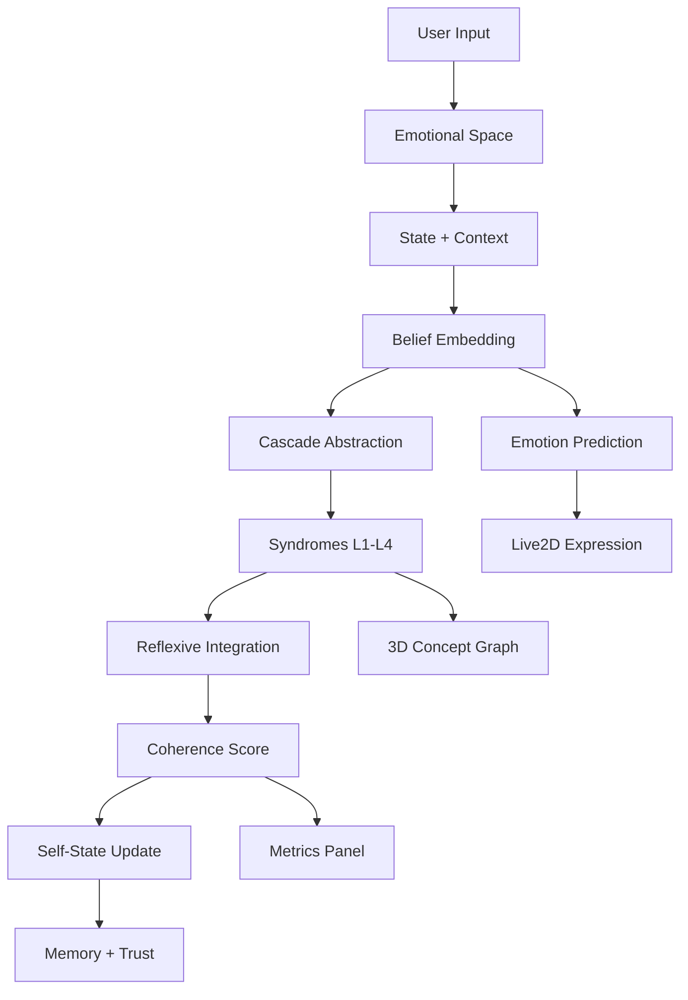

# Heim’s Syntrometric Agent & Live2D Demo  
[](https://marko0marky.github.io/syntrometry-agent-live2d/)  
[](https://github.com/marko0marky/syntrometry-agent-live2d/issues)  
[](https://github.com/marko0marky/syntrometry-agent-live2d/stargazers)  
[](https://github.com/marko0marky/syntrometry-agent-live2d/blob/main/LICENSE)

> An interactive demo of **Burkhard Heim’s Syntrometric Theory**, blending synthetic cognition with **TensorFlow.js**, **Three.js**, and **Live2D Cubism** to model emotions, beliefs, and 3D concept graphs.

This project transforms abstract theoretical structures into a responsive agent that models emotional dynamics, applies cascade abstraction, computes Reflexive Integration Heuristic (RIH), visualizes syntrometric syndromes, and animates a Live2D avatar.

---

## ✨ Table of Contents

- [🧠 Features](#-features)
- [📚 Concepts Explored](#-concepts-explored)
- [🎥 Live Demo](#-live-demo)
- [🚀 Quick Start](#-quick-start)
- [🧩 Cognitive Flow](#-cognitive-flow)
- [💡 Technologies](#-technologies)
- [⚙️ Controls](#-controls)
- [📈 Metrics](#-metrics)
- [📂 Project Structure](#-project-structure)
- [📉 Roadmap](#-roadmap)
- [🤝 Contributing](#-contributing)
- [❓ FAQ](#-faq)
- [📄 License](#-license)
- [🙏 Acknowledgments](#-acknowledgments)

---

## 🧠 Features

| Feature | Description |
|---------|-------------|
| **Reflexive Integration (RIH)** | Quantifies belief system harmony |
| **Belief Embedding Network** | Encodes emotions, states, and graphs |
| **Cascade Abstraction** | Condenses beliefs into syndromes (L1-L4) |
| **Emotion Prediction** | Blends Joy, Fear, Curiosity, Frustration, Calm, Surprise |
| **Live2D Avatar** | Reflects emotions and head movements |
| **Memory Buffer** | Tracks past beliefs for trust scoring |
| **Trust Evaluation** | Measures consistency with prior states |
| **Self-Learning** | Dynamically adjusts integration/reflexivity |
| **Interactive UI** | Sliders, chat input, state save/load |
| **3D Visualization** | Renders concept graphs with Three.js |

---

## 📚 Concepts Explored

This project simplifies key ideas from **Syntrometric Theory** for interactive exploration:
- **Syntrometry**: A framework for unifying abstract and physical interactions via multidimensional systems.
- **Structural Condensation**: Building complex structures from simpler components across levels (L1-L4).
- **Reflexive Integration Hierarchy (RIH)**: A metric of systemic coherence and stability.
- **Affinities**: Strength of connections between states in the belief network.
- **Emotional Layer**: Environmental cues influencing the agent’s emotional responses.

*Note: This is a conceptual implementation for educational purposes, not a mathematically complete model.*

---

## 🎥 Live Demo

🔗 [Try it now](https://marko0marky.github.io/syntrometry-agent-live2d/)  


---

## 🚀 Quick Start

### Requirements
- Modern browser with **WebGL** support
- Internet connection (for CDN dependencies)
- Local HTTP server (to avoid CORS issues)

### Steps
1. Clone the repository:
   ```bash
   git clone https://github.com/marko0marky/syntrometry-agent-live2d.git
   ```
2. Navigate to the project folder:
   ```bash
   cd syntrometry-agent-live2d
   ```
3. Serve the project using one of these options:
   - **Node.js**: `npx live-server .`
   - **Python**: `python -m http.server 8000`
   - **VSCode**: Use the Live Server extension and click "Go Live"
4. Open [http://localhost:8080](http://localhost:8080) (or the specified port) in your browser.

---

## 🧩 Cognitive Flow



⚠️ View in GitHub or a Mermaid-compatible Markdown viewer (e.g., VSCode with Mermaid extension).

---

## 💡 Technologies

| Technology | Role |
|------------|------|
| **TensorFlow.js** | Neural networks for belief and emotion modeling |
| **Three.js** | 3D rendering of concept graphs |
| **Pixi.js + Live2D Cubism** | Animated 2D avatar |
| **WebGL** | GPU-accelerated visualizations |
| **HTML5/CSS3** | Responsive interface |
| **ES Modules** | Modular JavaScript structure |

---

## ⚙️ Controls

| Control | Function |
|---------|----------|
| **Integration Slider** | Adjusts belief persistence |
| **Reflexivity Slider** | Modulates adaptability |
| **Chat Input** | Sends text for emotional cues |
| **Save State** | Stores current simulation state |
| **Load State** | Restores saved session |

Controls update the Live2D avatar and graphs in real-time.

---

## 📈 Metrics

| Metric | Description |
|--------|-------------|
| **R (RIH Score)** | Belief system stability (0–1) |
| **A (Affinity)** | Layer connection strength |
| **T (Trust)** | Consistency with past beliefs |
| **CV (Cascade Variance)** | Clarity of abstraction layers |
| **I (Integration)** | Memory stability parameter |
| **Ψ (Reflexivity)** | Adaptation tendency |
| **F (Emotion)** | Dominant emotion intensity |

---

## 📂 Project Structure

```
syntrometry-agent-live2d/
├── index.html           # Entry point
├── README.md            # Documentation
├── LICENSE              # MIT License
├── Syntrometry.gif      # Demo animation
├── style.css            # Styling
└── js/
    ├── config.js        # Configuration
    ├── utils.js         # Helper functions
    ├── agent.js         # Cognitive logic
    ├── environment.js   # Input processing
    ├── viz-syntrometry.js # 3D graph rendering
    ├── viz-concepts.js  # Graph interactions
    └── viz-live2d.js   # Live2D controls
```

---

## 📉 Roadmap

| Feature | Priority | Status |
|---------|----------|--------|
| Recurrent emotion modeling | High | In Progress |
| Complex expression blending | Medium | Planned |
| Semantic graph zoom | Medium | Researching |
| Anomaly detection visuals | Low | Designing |
| Plugin-based rules | Low | Ideation |

---

## 🤝 Contributing

We welcome contributions from developers passionate about:
- Synthetic cognition
- Emotional AI
- Structural theory
- Live2D/TensorFlow.js

### How to Contribute
1. Fork the repository
2. Create a branch: `git checkout -b feature/your-feature`
3. Commit changes: `git commit -m "Add feature"`
4. Push: `git push origin feature/your-feature`
5. Open a Pull Request

Discuss large changes in an issue first.

---

## ❓ FAQ

<details>
<summary>Why is the Live2D model not loading?</summary>
Ensure you're using a local HTTP server (e.g., `npx live-server`, `python -m http.server`) to avoid CORS issues.
</details>

<details>
<summary>Why are emotions not blending?</summary>
Check that `emotionNames.length` matches `EMOTION_DIM` in `config.js`.
</details>

<details>
<summary>Why are there visualization glitches?</summary>
Verify WebGL is enabled at [get.webgl.org](https://get.webgl.org/) and check the console for tensor disposal errors.
</details>

<details>
<summary>Why is performance slow?</summary>
Close heavy browser tabs, reduce canvas resolution, or use a dedicated GPU.
</details>

---

## 📄 License

MIT License – free to use, modify, and distribute.  
See [LICENSE](./LICENSE) for details.

---

## 🙏 Acknowledgments

- **Burkhard Heim** for Syntrometric Theory
- **TensorFlow.js**, **Three.js**, **Pixi.js**, and **Live2D** teams
- The [heim-theory.com](https://heim-theory.com/) community for preserving Heim’s legacy

---

🌟 **Star this repository** if you’re excited about cognitive AI and interactive visualizations!
